<p align="center">
  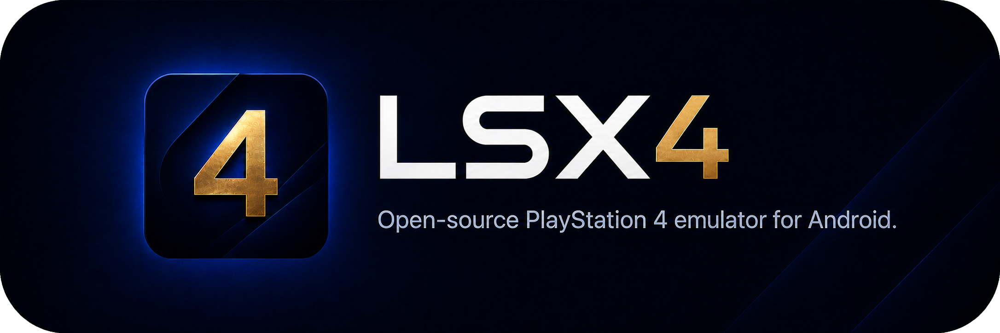
</p>

<div align="center">
  
  <a href="https://discord.gg/p5KBs5cHsX"></a>
  <br>
  <a href="https://ko-fi.com/llayer"></a>
</div>

# LSX4

LSX4 is an open-source PlayStation 4 emulator application for Android.

LSX4 does not include games, firmware, or other copyrighted system content.

Development also makes use of current-generation large language models (LLMs).

## Current development priorities

- Improving performance in playable games.
- Expanding title compatibility by resolving frontiers and invariants.
- Implementing Mali support and improving performance on Mali devices.
- Increasing the number of playable titles by testing currently untested games.

## Playable games

Tested on devices powered by Snapdragon 8 Gen 3 and Snapdragon 8 Gen 5.

<table>
  <tr>
    <td align="center" width="50%">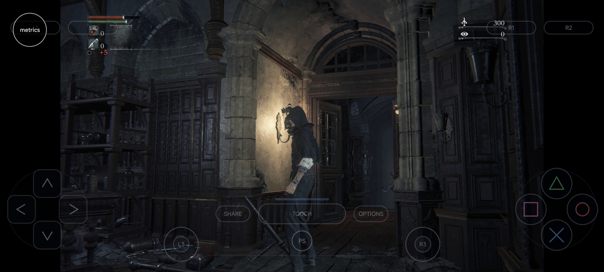<br><sub><b>Bloodborne</b></sub></td>
    <td align="center" width="50%">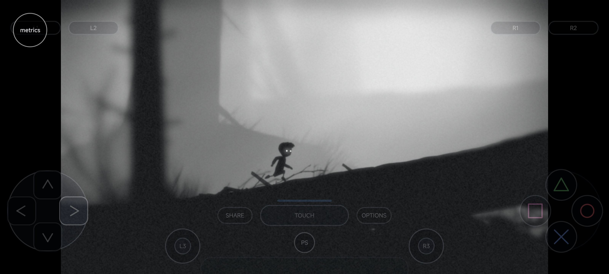<br><sub><b>Limbo</b></sub></td>
  </tr>
  <tr>
    <td align="center" width="50%">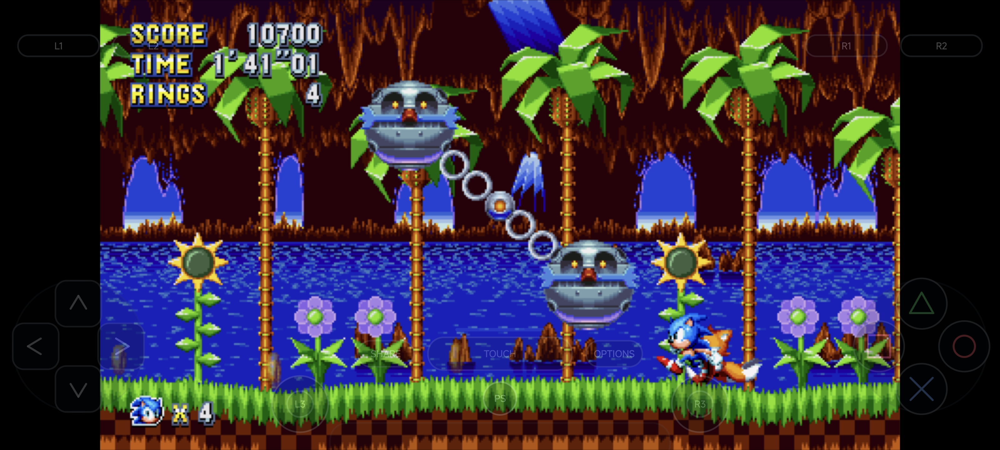<br><sub><b>Sonic Mania</b></sub></td>
    <td align="center" width="50%">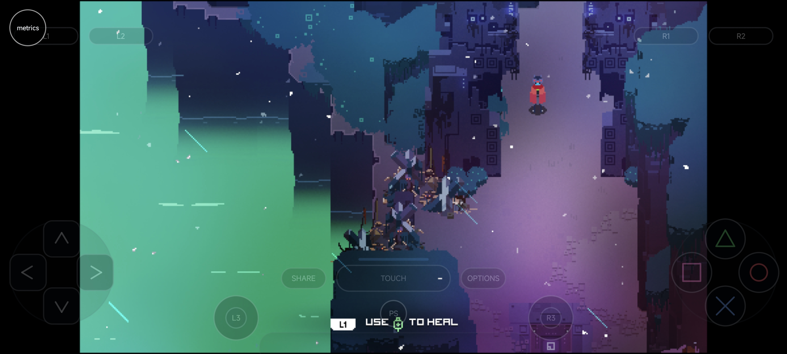<br><sub><b>Hyper Light Drifter</b></sub></td>
  </tr>
  <tr>
    <td align="center" width="50%">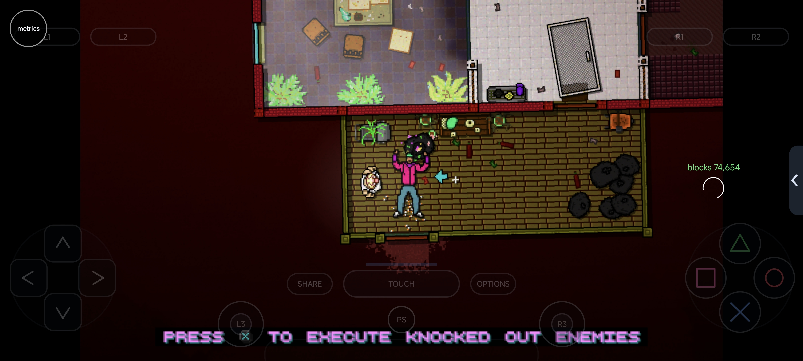<br><sub><b>Hotline Miami 2: Wrong Number</b></sub></td>
    <td align="center" width="50%">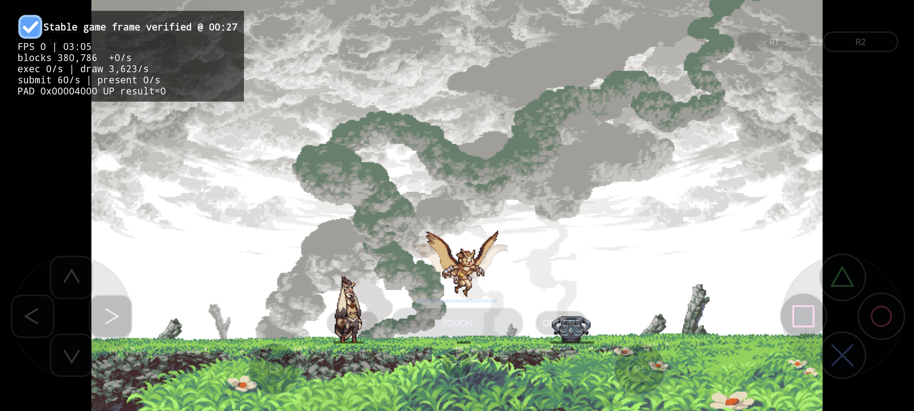<br><sub><b>Owlboy</b></sub></td>
  </tr>
  <tr>
    <td align="center" width="50%">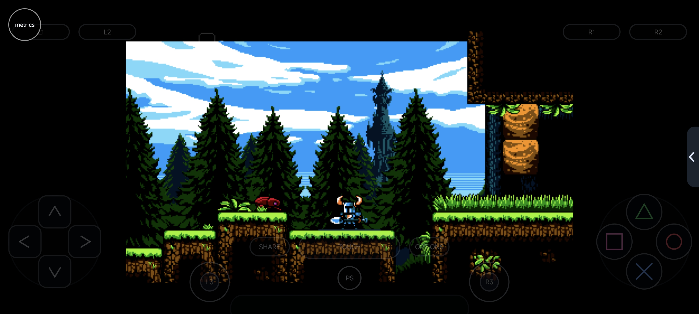<br><sub><b>Shovel Knight</b></sub></td>
    <td align="center" width="50%">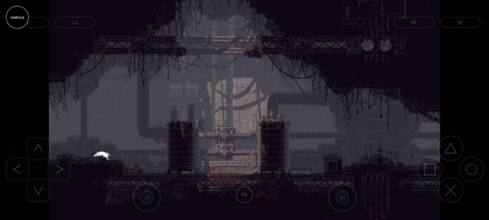<br><sub><b>Rain World</b></sub></td>
  </tr>
  <tr>
    <td align="center" width="50%">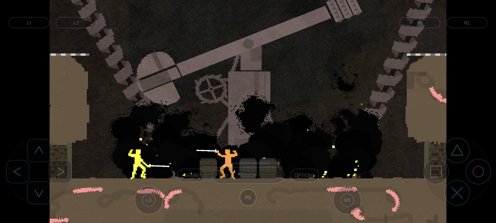<br><sub><b>Nidhogg</b></sub></td>
    <td align="center" width="50%">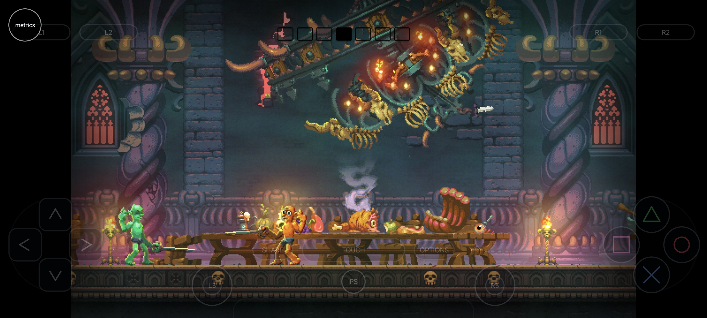<br><sub><b>Nidhogg 2</b></sub></td>
  </tr>
  <tr>
    <td align="center" width="50%">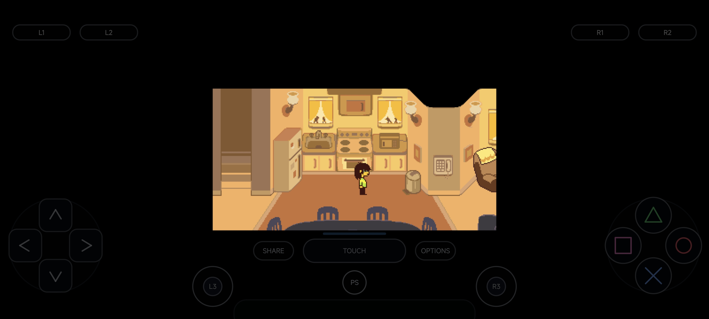<br><sub><b>Deltarune Chapters 1 &amp; 2</b></sub></td>
    <td align="center" width="50%">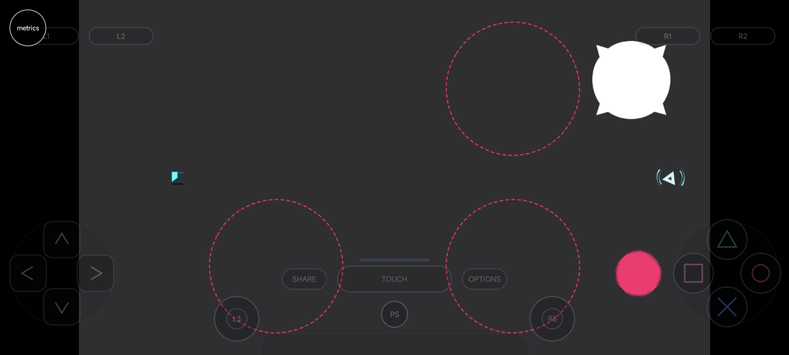<br><sub><b>Just Shapes &amp; Beats</b></sub></td>
  </tr>
  <tr>
    <td align="center" width="50%">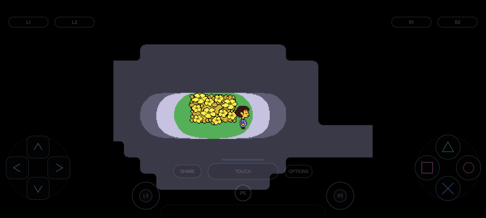<br><sub><b>Undertale</b></sub></td>
    <td align="center" width="50%">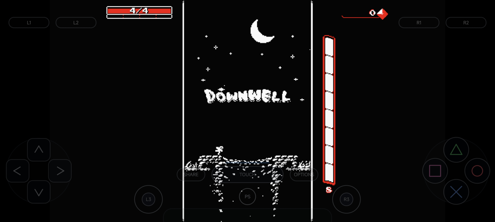<br><sub><b>Downwell</b></sub></td>
  </tr>
  <tr>
    <td align="center" width="50%">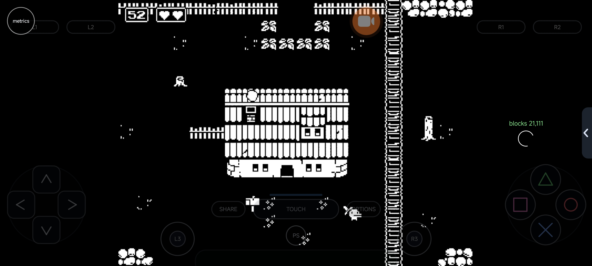<br><sub><b>Minit</b></sub></td>
    <td align="center" width="50%">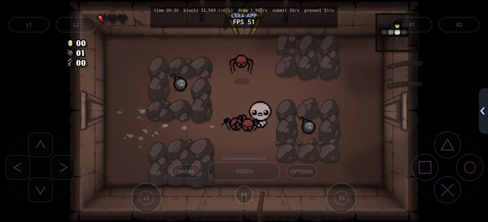<br><sub><b>The Binding of Isaac: Rebirth</b></sub></td>
  </tr>
</table>

This list includes only games that have been tested. The broader set of supported games is larger and still requires testing.

| Game | Playable | Notes |
| --- | :---: | --- |
| Bloodborne | ✅ | Gameplay is temporarily limited to 7 FPS. |
| Deltarune Chapters 1 & 2 | ✅ | |
| Downwell | ✅ | |
| Hotline Miami 2: Wrong Number | ✅ | |
| Hyper Light Drifter | ✅ | |
| Just Shapes & Beats | ✅ | |
| Limbo | ✅ | |
| Minit | ✅ | |
| Nidhogg | ✅ | |
| Nidhogg 2 | ✅ | |
| Owlboy | ✅ | |
| Rain World | ✅ | |
| Shovel Knight | ✅ | |
| Sonic Mania | ✅ | |
| The Binding of Isaac: Rebirth | ✅ | |
| Undertale | ✅ | |

## Contributing

Contributions are welcome. Bug reports, compatibility results, performance traces, and focused pull requests are especially useful. Please open an issue before starting a substantial architectural change.

## Repository layout

| Path | Purpose |
| --- | --- |
| `android-app/` | LSX4 Android application |
| `src/` | LSX4 client-owned native translation and Android runtime sources |
| `externals/` | Native build dependencies |
| `cmake/` | Android native build support |
| `scripts/` | Android dependency build helpers |
| `funnel-arm/` | Android/ARM-adapted emulation layer and authoritative native source profile; desktop distributions and duplicate externals are intentionally absent |
| `assets/` | Project artwork |

## Android application

```sh
cd android-app
./gradlew assembleDebug
```

The debug-only test mode can package a locally owned, decrypted NGS2 module from a
shad4pc `sys_modules` directory:

```sh
./gradlew assembleDebug -Pshad4pcNgs2Module=/path/to/shad4pc/user/sys_modules/libSceNgs2.sprx
```

`SHAD4PC_NGS2_MODULE` provides the same path through the environment. The module is
never included in release assets. LSX4 records the hash of a module installed by test
mode and removes only that managed copy when test mode is disabled or a release build
is launched; a module imported by the user is left untouched.

## Native runtime

```sh
git submodule update --init --recursive
powershell -File scripts/build-ffmpeg-android-pic.ps1
cmake --preset android-arm64-release
cmake --build --preset android-arm64-release
```

The native ownership boundary and optimization strategy are documented in
[`docs/arm_desktop_client_layer_architecture.md`](docs/arm_desktop_client_layer_architecture.md).
